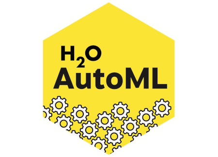
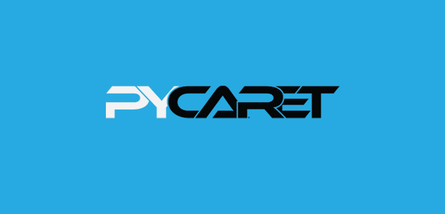
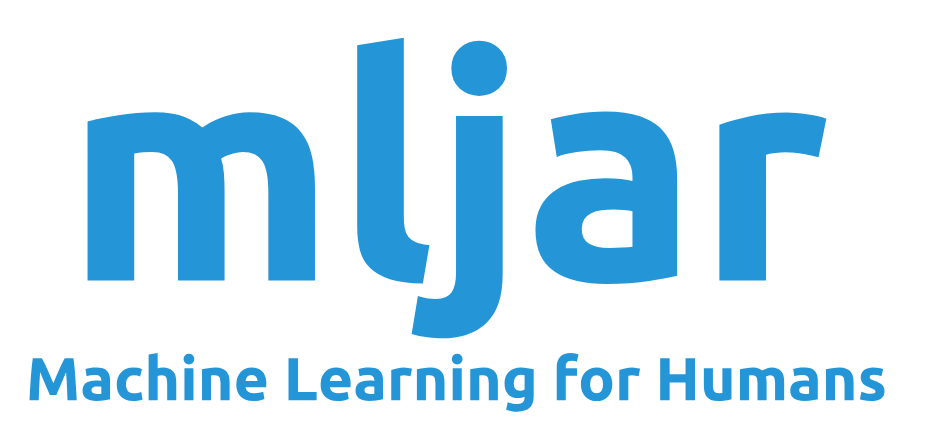
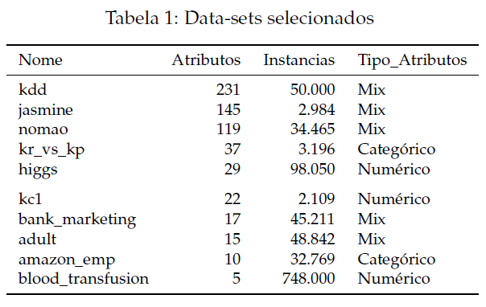

```{r setup, include=FALSE}
knitr::opts_chunk$set(echo = FALSE, message=FALSE, warning=FALSE, fig.align="center")
```

# Automated Machine Learning

-   Auto ML fornece métodos e processos para disponibilizar o Aprendizado de Máquina para não especialistas na área, para melhorar a eficiência e acelerar o processo de experimentação de criação de modelos.

-   Frameworks de AutoML podem serem capazes de:

    -   Pré-processamento e limpeza dos dados;

    -   Selecionar e construir vetores de características;

    -   Selecionar uma família de modelos apropriados para o problema;

    -   Otimizar hiperparâmetros do modelo;

    -   Construir a topologia de redes neurais;

    -   Analisar os resultados obtidos.

# Literatura

-   O projeto *AutoML Benchmark Framework* da Fundação Open Machine Learning (openml.org) serviu como base para parte da metodologia adotada nos experimentos, uma vez que o benchmark de AutoML é o mais robusto que encontramos na literatura;
-   Não foram identificados artigos ou outros benchmarks robustos que analisem a performance de frameworks de AutoML privados.

# Objetivo do Projeto

-   O objetivo do projeto é comparar as características e a performance de frameworks de Auto ML privados e públicos;

-   Os frameworks escolhidos foram:

::: columns
::: column
\center Privados

```{r, out.width='25%'}
knitr::include_graphics('img/aws_logo.png')
```

```{r, out.width='25%'}

```

```{r, out.width='25%'}

```
:::

::: column
\center Públicos

```{r, out.width='25%'}

```

```{r, out.width='25%'}

```

```{r, out.width='25%'}

```
:::
:::

# Experimentos

## Dados

-   Foram escolhidos 10 datasets também utilizados pelo projeto de referência *OpenML Benchmark Framework;*

-   Os datasets escolhidos possuem diferentes volumes de atributos e instâncias entre si, bem como diferentes tipos de dados;

    ```{r, out.width='80%'}
    
    ```

## Premissas

-   Tempo de processamento: 1 hora;
-   Ambiente de Processamento: Cloud para privados e Google Colab para públicos;
-   Métrica de otimização: ROC-AUC;
-   Parâmetros adicionais: Optamos por utilizar a maior quantidade possível de parâmetros padrão de cada ferramenta;
-   Outras limitações: Quando possível, desconsideramos resultados de Redes Neurais e modelos Ensemble.

## Experiência de uso

::: columns
::: column
\center Privados

-   \small Interface interativa de fácil uso;
-   \small Falta de clareza quanto aos custos durante processamento;
-   \small AWS: Exporta os notebooks criados automaticamente pela ferramenta;
-   \small Google: Não mostra metodologia, modelo utilizado ou qualquer tipo de informação sobre o processamento dos dados;
-   \small Dataiku: O mais intuitivo e fácil de usar.
:::

::: column
\center Públicos

-   \small Necessidade de conhecimentos de código em python para uso;
-   \small Dificuldades em processar datasets muito grandes por limitação de máquina;
-   \small H2O: Necessidade de configuração próprias da biblioteca como a tranformação de DataFrames;
-   \small MLJar: Exporta um HTML interativo com os resultados dos experimentos, incluindo gráficos para análise;
-   \small Pycaret: O mais intuitivo e fácil de usar, pois, precisa de poucas linhas de código.
:::
:::

# Resultados

## Comparação ROC-AUC

```{r, out.width='80%'}
knitr::include_graphics('img/roc_auc.png')
```

## Ranking por Framework

-   Para analisar a performance dos frameworks de forma agrupada, utilizamos o seguinte método:
    -   Para cada dataset, criamos um ranking ordenado pela performance da métrica ROC-AUC de cada framework obtida por em cada framework, onde o melhor desempenho fica na posição 6 e o pior desempenho recebe a posição 1;

    -   Dessa forma, o ranking passa a valer como uma espécie de pontuação com base no desempenho de cada framework, possibilitando a criação do seguintes gráficos:

## Ranking por framework

```{r, out.width='80%'}
knitr::include_graphics('img/rank_framework.png')
```

## Ranking por tipo

```{r, out.width='80%'}
knitr::include_graphics('img/rank_tipo.png')
```

# Conclusões

-   O framework Google obteve a melhor performance mas é uma "caixa preta" e não diz qual tipo de técnica utilizou para alcançar seus resultados;
-   Comparando os demais frameworks, os públicos tiveram resultados muito competitivos quando comparados com os privados, com destaque para o MLJar que obteve restultados muito próximos aos da AWS Autopilot;
-   Pycaret obteve a pior performance entre todos os frameworks analisados.

## Possíveis próximos passos

-   Coletar dados de custos financeiros das plataformas privadas;
-   Utilizar todas as features de cada framework, incluindo Deep Learning;
-   Estender a quantidade de datasets, incluindo problemas de classificação multi classse e regressão.

# Obrigado!
